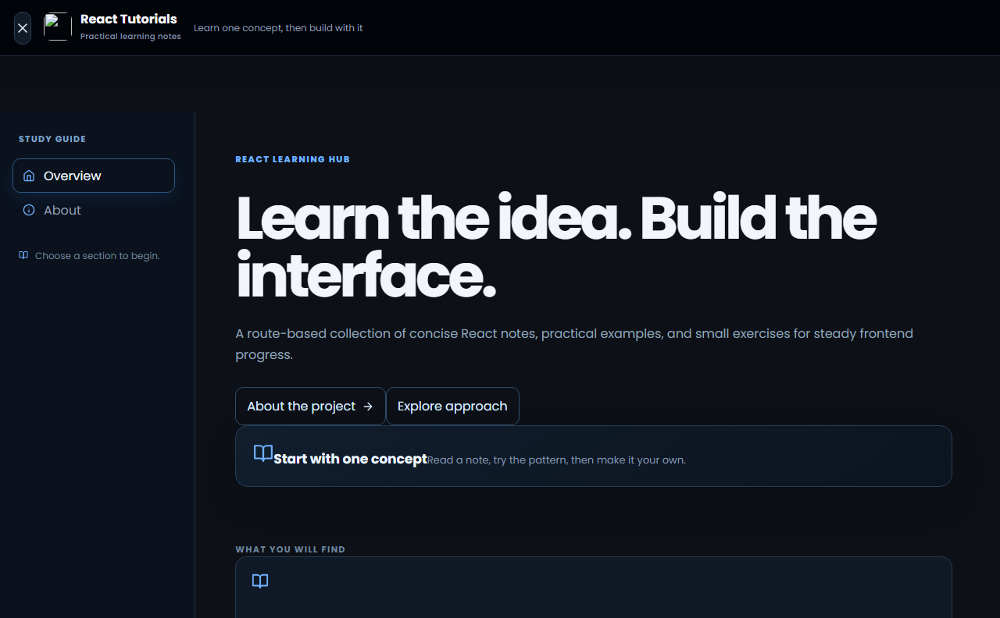

# React Tutorials

A route-based learning hub of concise React notes, practical examples, and frontend patterns.



## Features

- Fixed header with an independently scrollable study guide
- Lazy-loaded Home, About, and fallback routes
- Route changes reset the content panel to the top
- Responsive layout with a mobile-friendly navigation control
- Icon-only portfolio, social, and support links in the footer
- Floating back-to-top control

## Tech stack

React, Vite, React Router, styled-components, Material UI, and React Icons.

## Run locally

```bash
npm install
npm run dev
```

Create a production build with `npm run build`. Deploy to GitHub Pages with `npm run deploy`.

## Links

- Portfolio: [ashishranjan.net](https://www.ashishranjan.net/)
- GitHub: [github.com/a2rp](https://github.com/a2rp)
- CodePen: [codepen.io/ash1198](https://codepen.io/ash1198)
- LinkedIn: [linkedin.com/in/aashishranjan](https://www.linkedin.com/in/aashishranjan)
- Facebook: [facebook.com/theash.ashish](https://www.facebook.com/theash.ashish/)
- YouTube: [Ashish Ranjan](https://www.youtube.com/@ashishranjan-ashz?sub_confirmation=1)
- Email: [ash.ranjan09@gmail.com](mailto:ash.ranjan09@gmail.com)

## Support

- [Support](https://a2rp-donation-page.netlify.app/)
- [Buy Me a Coffee](https://buymeacoffee.com/a2rp)
- [Patreon](https://www.patreon.com/a2rp)

## Future improvements

- Add deeper lesson routes as the tutorial library grows
- Add small runnable examples for each learning note
